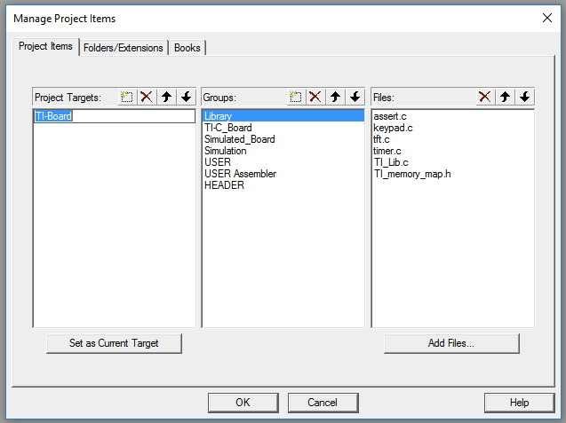
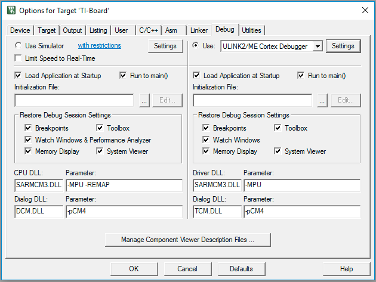
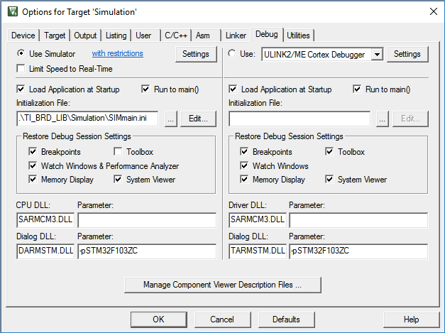

# Project Setup
Diese Dokumentation beschreibt die Einrichtung eines µVision Projekts mit mehrere Targets. Insbesondere wird auf das Einhängen der Targets **Simulation** und **TI-Board** eingegangen.
Diese Beschreibung legt uVision Version 5.20 zugrunde.

## Manuell neues Projekt anlegen
Zuerst wird ein neues µVision Projekt angelegt. Zur Unterstützung der Simulation muss das git Submodule TI_BRD_LIB verwendet werden.  

* Neuen Ordner für Projekt anlegen
* GIT-BASH:
	* machen Sie ein `git init`.
	* laden sie das LIB-Modul: `git submodule add https://gitlab.informatik.haw-hamburg.de/tiboard_dev/TI_BRD_LIB.git TI_BRD_LIB`
* uVision starten
* Menuleiste -> Project -> new Project
* Namen festlegen
  * Select "Legacy Device Database..."
  * Search: "STM32F417ZG"
  * Das angezeigte Gerät anklicken
  * OK klicken

  * **Nein** klicken (do not copy startup file). Die entsprechenden startup files sind der der TI_BRD_LIB festgelegt.

Nun legen wir die Gruppenstruktur an:
* Menuleiste -> Project -> Manage -> Project Items...
	* Fügen Sie folgende Gruppen und die dazugehörigen Dateien hinzu:
		* Library (./TI_BRD_LIB/Library/)
		* TI-C_Board (./TI_BRD_LIB/TI-C_Board/)
		* Simulated_Board (./TI_BRD_LIB/Simulated_Board/)
		* Simulation (./TI_BRD_LIB/Simulation/)
		* USER
		* USER Assembler
		* HEADER
	* Schließen Sie das Fenster

## Einrichten mehrerer Targets
Ziel ist es sowohl für C- als auch für Assembler-Projekte jeweils ein Target für das TI-Board und ein Target für die Simulation zu haben. Um die Einrichtung zu erleichtern sollte die Reihenfolge beachtet werden, da beim erstellen eines neuen Targets alle Einstellungen des aktuellen Targets kopiert werden.

Target Reihenfolge:
1. "TI-Board" fertig einrichten
3. "TI-Board Assembler" kopieren der Einstellungen
3. "Simulation" neu einrichten
4. "Simulation Assembler" kopieren der Einstellungen

### "TI-Board" fertig einrichten
Das Projekt wurde gerade neu angelegt. Es gibt nur ein "Target 1". Dieses wollen wir umbenennen.
* Menuleiste -> Project -> Manage -> Project Items...
* klicken Sie auf "Target 1" und bennenen Sie es in "TI-Board"
* Mit "Ok" das Fenster schließen

Nun wollen wir die Einstellungen für dieses Target verändern.
* Menuleiste -> Project -> Options for Target 'TI-Board'...
  * Reiter "Target"
    * KEIN Haken bei "User MicroLIB"

  * Reiter "C/C++"
    * Haken bei "One ELF Section per Function"
    * Haken bei "C99 Mode"
    * Include Paths: "TI_BRD_LIB\Library; .\TI_BRD_LIB\TI-C_Board" hinzufügen

  * Reiter "Debug"
    * Rechts: Use "ULINK Pro Cortex Debugger"

  * -> "Settings"
      * Reiter "Flash Download"
        * "Add"
          * "STM32F4xx Flash" mit Flash Size "1M" auswählen
        * Haken bei "Program", "Verify" und "Reset and Run"
        * "Erase Sectors" wählen
        * OK

Nun legen wir fest, welche Groups bei diesem Target zum Build gehören. Die folgenden Anweisungen werden jeweils für die Gruppen
**Simulated_Board**,
**Simulation** und
**USER Assembler**
gemacht:

* Im Projektbaum einen Rechtsklick auf die Gruppe machen
	* "Options for Group..." wählen

* den Haken bei "Include in Target Build" wegnehmen.

### "TI-Board Assembler" kopieren der Einstellungen
Wir kopieren nun die Einstellungen von "TI-Board" in ein weiteres Target "TI-Board Assembler".
* Menuleiste -> Project -> Manage -> Project Items...
	* Ein neues Target erstellen durch Klick auf den ersten Button neben "Project Targets"
	* Neues Target "TI-Board Assembler" nennen
	* "Set as Current Target" anklicken
	* Mit OK das Fenster schließen

* Wir ändern nun wieder welche Source-Groups zum Build gehören:
	* Im Projektbaum einen Rechtsklick auf die Gruppe **"USER"** machen
	*	"Options for Group..." wählen
	* den Haken bei "Include in Target Build" **wegnehmen**.
	* Im Projektbaum einen Rechtsklick auf die Gruppe **"USER assembler"** machen
	*	"Options for Group..." wählen
	* den Haken bei "Include in Target Build" wieder **grau angehakt** klicken (wenn der haken schwarz ist, dann noch ein mal klicken).

### "Simulation" neu einrichten
Wir kopieren nun zu Beginn die Einstellungen von "TI-Board" in ein neues Target "Simulation".
* Menuleiste -> Project -> Manage -> Project Items...
	* Target "TI-Board" anklicken
	* "Set as Current Target" anklicken
	* Ein neues Target erstellen durch Klick auf den ersten Button neben "Project Targets"
	* Neues Target "Simulation" nennen
	* "Set as Current Target" anklicken
	* Mit OK das Fenster schließen

Nun müssen wir die Einstellungen so verändern, dass die Simulation benutzt wird:
* Menuleiste -> Project -> Options for Target 'TI-Board'...
	* Reiter "Device"
		* Search: STM32F103ZC
		* gefundenes Gerät auswählen

* Reiter "C/C++"
	* Define: **"SIMULATION STM32F10X_HD"** hinzufügen
	* Include Paths mit __"TI_BRD_LIB\Library; .\TI_BRD_LIB\Simulated_Board"__ ersetzen

* Reiter "Debug" linke Hälfte:
	* Use Simulator auswählen
	* Initialization File: "TI_BRD_LIB/Simulation/SIMmain.ini" wählen
	* Haken bei Toolbox entfernen

* Wir ändern nun wieder welche Source-Groups zum Build gehören:
	* Im Projektbaum einen Rechtsklick auf die Gruppe **"TI-C_Board"** machen
		*	"Options for Group..." wählen
		* den Haken bei "Include in Target Build" **wegnehmen**.
	* Im Projektbaum einen Rechtsklick auf die Gruppe **"Simulated_Board"** machen
		*	"Options for Group..." wählen
		* den Haken bei "Include in Target Build" wieder **grau angehakt** klicken (wenn der haken schwarz ist, dann noch ein mal klicken).
	* Im Projektbaum einen Rechtsklick auf die Gruppe **"Simulation"** machen
		*	"Options for Group..." wählen
		* den Haken bei "Include in Target Build" wieder **grau angehakt** klicken (wenn der haken schwarz ist, dann noch ein mal klicken).

### "Simulation Assembler" kopieren der Einstellungen
Wir kopieren nun die Einstellungen von "Simulation" in ein weiteres Target "Simulation Assembler".
* Menuleiste -> Project -> Manage -> Project Items...
  * Target "Simulation" anklicken
    * "Set as Current Target" anklicken
  * Ein neues Target erstellen durch Klick auf den ersten Button neben "Project Targets"
    * Neues Target "Simulation Assembler" nennen
    * "Set as Current Target" anklicken
  * Mit OK das Fenster schließen

* Wir ändern nun wieder welche Source-Groups zum Build gehören:
	* Im Projektbaum einen Rechtsklick auf die Gruppe **"USER"** machen
	  *	"Options for Group..." wählen
	  * den Haken bei "Include in Target Build" **wegnehmen**.
	* Im Projektbaum einen Rechtsklick auf die Gruppe **"USER assembler"** machen
	  *	"Options for Group..." wählen
	  * den Haken bei "Include in Target Build" wieder **grau angehakt** klicken (wenn der haken schwarz ist, dann noch ein mal klicken).
