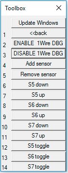

Wie benutze ich die Keil-Simulation und Stimuli
===============================================

Einführung
----------
Die Simulation versucht das Verhalten des TI-Boards mit Einschränkungen nachzustellen. So soll den Studenten die Möglichkeit gegeben werden, ihren Code auch ohne TI-Board zu testen. Für Assembler-Projekte sind die Abschnitte **Target Auswahl**, **Simulation TFT-Display und LEDS**, **Toolbox** und **GTP stiumli** relevant.


Target Auswahl
--------------
Das Basisprojekt hat vier Targets. Die Ziele **TI-Board** und **Simulation** beziehen sich auf C-Projekte. Zwischen diesen Targets kann gewechselt werden, um den gleichen C-Code entweder auf das TI-Board zu spielen oder zu simulieren.

Die Ziele **TI-Board Assembler** und **Simulation Assembler** beziehen sich auf Assembler-Projekte.
Zwischen diesen Targets kann gewechselt werden, um den gleichen Assembler-Code entweder auf das TI-Board zu spielen oder zu simulieren.

Um das Target zu wechseln, klickt man einfach auf das Dropdown-Menu rechts neben dem Download-Button und wählt das entsprechende Target aus.


**Wichtig** Bei jedem Wechsel zwischen TI-Board und Simulation sollte ein "Rebuild" gemacht werden (nicht nur "Build"). Danach wird die Simulation über den Debug-Session-Button gestartet (genau so, wie man auch das TI-Board debuggen würde).

__Wenn man die Simulation resetten möchte, sollte die Debug-Session erneut gestartet werden, um zu gewährleisten, dass auch die simulierte Umgebung korrekt resettet wurde.__


Der Code
--------
Damit dein Code sowohl mit dem TI-Board als auch der Simulation kompatibel ist, sollte man statt der üblichen `stm32f4xx.h` das Header-File `TI_memory_map.h` includen. Nun hat man den Zugriff auf z.B. GPIOG und GPIOE, wie man es gewohnt ist, jedoch funktioniert es auch in der Simulation ohne den Code bei jedem Wechsel zu verändern.

Die Simulation läuft nicht in Echtzeit, daher wird empfohlen bei langen Delays oder ähnlichem den Code mit einem If-Then-Else-Block im Präprozessor etwas zu beschleunigen.
```C
#ifdef SIMULATION
	#define ONE_SEC_DELAY_IN_uS 1000 //hier nur 1ms fuer die Simulation
#else
	#define ONE_SEC_DELAY_IN_uS 1000000 //hier wirklich 1s
#endif
```

<div class=page-break></div>

Toolbox
-------
In der Toolbox stehen die __Stimuli__ für die GS Praktika 1, 2 und 4 zur Verfügung. Falls das Toolbox-Fenster nicht automatisch geöffnet wird findet man es unter folgendem Button:


So sieht die Toolbox beim Starten der Simulation aus.

Stimuli
-------
Immer als ERSTES in der Toolbox die Aufgabe wählen! Erst danach sollte auf "Run" geklickt werden.

Terminal
--------
In der Simulation finden sie den "Terminal" bzw. die Serielle Schnittstelle (printf) in uVision im Menu unter:
* __View__ -> __Serial Windows__ -> __UART \#1__

<div class=page-break></div>

Simulation TFT-Display und LEDs
-------------------------------
Das TFT-Display des TI-Boards wir im Speicher simuliert. Hierfür nimmt man einfach ein Memory-Fenster und gibt als Adresse "DISPLAY_MAP" an. Die Darstellung kann man mit einem Rechtsklick auf ASCII umstellen. Als Umrandung des Displays sind Rauten dargestellt, so kann die richtige Breite für das Fenster gewählt werden.
Unterhalb des Displays sind auch die Blauen LEDs dargestellt, welche am GPIOG liegen. Ein "\*" unterhalb der LED-Bezeichnung (z.B. D13) zeigt an, dass diese LED an ist. Ein "\_" steht für eine LED, welche aus ist.

__ES IST MÖGLICH, DASS DAS MEMORY-FENSTER NICHT GANZ AKTUELL IST. UM SICHER ZU GEHEN, DASS DIE ANZEIGE MIT AKTUELLEN WERTEN DARGESTELLT WIRD, SOLLTE DER ADRESSBEREICH NEUGELADEN WERDEN!__


Logic Analyzer
--------------
Der Logic Analyzer ist unter __View__ -> __Analysis Windows__ -> __Logic Analyzer__ zu finden.
Klicke auf __Setup...__ und anschließend auf __Import Signal Definitions...__ um eine Einstellung zu laden. Die Files liegen in: /TI_BRD_LIB/Logic Analyzer
* Drehgeber.uvl
* OneWire.uvl

<div class=page-break></div>

Einschränkungen
---------------
#### GPIO
Es sollte nur auf __GPIOE__ und __GPIOG__ zugegriffen werden. __GPIOG__ unterstützt auf den unteren acht Bits alle GPIO Operationen *(ODR, IDR, MODER, OTYPER...)*. Die oberen acht Bits des GPIOG sind als Outputs (LEDs D21 bis D28) initialisiert und können nicht über MODER oder OTYPER umkonfiguriert werden.
__GPIOE__ kann nicht umkonfiguriert werden und ist als Input Register initialisiert.

#### Timer
Die Simulation unterstützt den Timer TIM2. Der Timer in der Simulation funktioniert auch ohne korrekte Initialisierung! Er läuft ab Beginn der Simulation. Somit kann man die Initialisierung des Timers in der Simulation nicht testen.

#### Performance
In der Simulation wird ein anderer Prozessor verwendet, als auf dem TI-Board daher kann es Abweichungen in der Performance geben. In der Tendenz sollte das TI-Board schneller sein als das simulierte Board. Besonders wenn viele Floating-Point-Berechnungen gemacht werden.

#### Display
Das simulierte Display unterstützt nicht alle Funktionen des TFT auf dem TI-Board. Alle nicht unterstützten Funktionen werden einfach ignoriert. Somit ist auch das Keypad auf dem Display nicht sichtbar.
Implementierte Funktionen:
- gotoXY
- setWindow
- putc
- puts

### Interrupts
Interrupts werden in der Simulation nicht unterstützt. Diese können nur auf dem TI-Board verwendet werden.

<div class=page-break></div>

# Stimuli für das GTP
## Stoppuhr


* Die Buttons S5 bis S7 simulieren jeweils das Drücken und nach 0.1s wieder Loslassen des entsprechenden Buttons.
* "1s" startet die Messung und beendet sie nach 1 Sekunde.
* "10s" startet die Messung und beendet sie nach 10 Sekunden.

# Stimuli für das GSP
| Taschenrechner | Drehgeber | One-Wire |
|----|----|----|
|  |  |  |

### A1: Taschenrechner RPN
Die hier angezeigten Buttons simulieren die Touch-Eingabe auf dem TFT. Wenn man auf einen Button klickt, wird dieses Zeichen bis zur nächsten Abfrage am Display gespeichert und dann übertragen. Wenn die Abfrage am Display noch nicht erfolgt ist und ein weiterer Button gedrückt wird, so wird das Zeichen überschrieben und nur das zuletzt gedrückte Zeichen wird übertragen.

### A2: Drehgeber
Ein Drehgeber wird an den Eingängen PE0 und PE1 simuliert.

Die Buttons S5, S6 und S7 können gedrückt, losgelassen oder getoggelt werden.

Mit den "Speed" Buttons kann man die Rotationsgeschwindigkeit des Drehgebers in Einer- oder Zehnerschritten verändern.

Der Button "Rotate by Angle" fragt nach einem Winkel. Danach wird an den Eingängen eine Rotation mit der eingestellten Geschwindigkeit simuliert.

Die "1 Step" Buttons sind unabhängig von der eingestellten Geschwindigkeit und verändern die Eingänge sofort. Mit ihnen lassen sich auch die Fehlerzustände simulieren, in dem man die Simulation anhält (Nicht zu verwechseln mit dem "Pause/Continue" Button). Danach macht man zwei Steps in die gleiche Richtung und anschließend lässt man die Simulation weiterlaufen.

Der "Pause/Continue" Button unterbricht die laufende Rotation oder führt sie auch fort.

### A4: OneWire
Dieses Modul simuliert den Temperatur-Sensor an PG0.

Die Buttons "ENABLE/DISABLE 1Wire DBG" erlauben es eine detailiertere Ausgabe zu den einzelnen Aktionen der One-Wire Sensoren ein- und auszuschalten.

Die Buttons "Add/Remove sensor" hängen weitere Sensoren an den Bus oder nehmen sie wieder ab.
1. Sensor liefert die Sequenz: -10.0 Grad, 0 Grad, 20 Grad
2. Sensor liefert die Sequenz:
	* 30.5, 10.25, -20.125, 30.0625, -50.75, 40.875, 0.9375
3. Sensor liefert immer den Wert -100 Grad, also außerhalb des Wertebereichs
4. Sensor sendet immer 20 Grad, jedoch mit falschem CRC.

Wie im Modul A2 können auch hier die Buttons S5, S6 und S7 gedrückt, losgelassen oder getoggelt werden.


<div class=page-break></div>

Eigene Stimuli
--------------
In der Datei __"userSIM.ini"__ können eigene Buttons erstellt werden oder automatisch Module für eine Aufgabe geladen werden.

Weitere Informationen zu der Simulationsumgebung findet man unter:

http://www.keil.com/support/man/docs/uv4/uv4_debug_commands.htm

http://www.keil.com/support/man/docs/uv4/uv4_debug_functions.htm

http://www.keil.com/support/man/docs/uv4/uv4_simulation.htm
